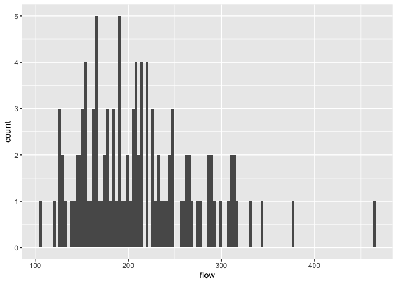
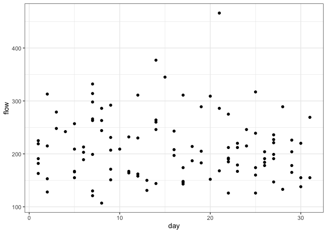
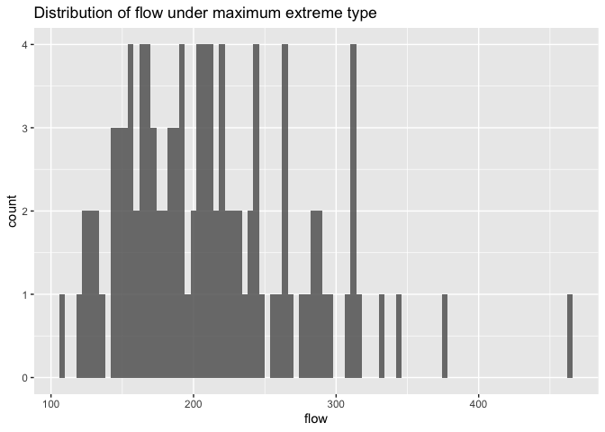
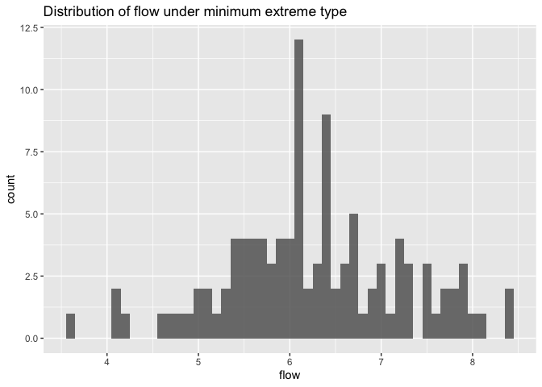
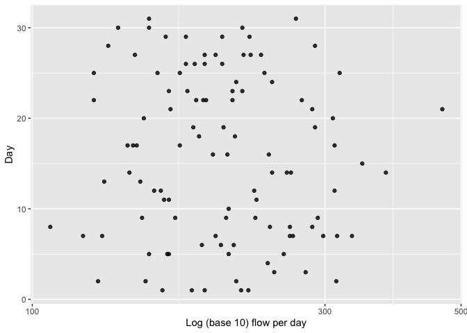
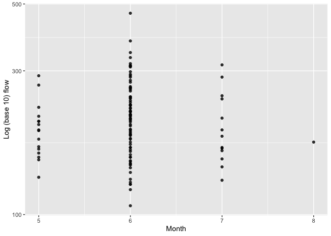
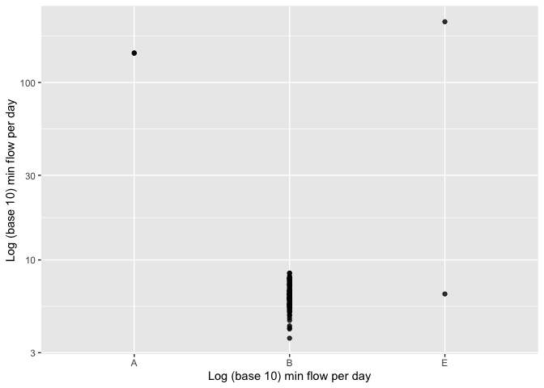

Mini Data-Analysis Deliverable 1
================

# Welcome to your (maybe) first-ever data analysis project!

And hopefully the first of many. Let’s get started:

1.  Install the [`datateachr`](https://github.com/UBC-MDS/datateachr)
    package by typing the following into your **R terminal**:

<!-- -->

    install.packages("devtools")
    devtools::install_github("UBC-MDS/datateachr")

2.  Load the packages below.

``` r
library(datateachr)
library(tidyverse)
```

    ## ── Attaching packages ─────────────────────────────────────── tidyverse 1.3.2 ──
    ## ✔ ggplot2 3.3.6      ✔ purrr   0.3.4 
    ## ✔ tibble  3.1.8      ✔ dplyr   1.0.10
    ## ✔ tidyr   1.2.1      ✔ stringr 1.4.1 
    ## ✔ readr   2.1.3      ✔ forcats 0.5.2 
    ## ── Conflicts ────────────────────────────────────────── tidyverse_conflicts() ──
    ## ✖ dplyr::filter() masks stats::filter()
    ## ✖ dplyr::lag()    masks stats::lag()

3.  Make a repository in the <https://github.com/stat545ubc-2022>
    Organization. You will be working with this repository for the
    entire data analysis project. You can either make it public, or make
    it private and add the TA’s and Lucy as collaborators. A link to
    help you create a private repository is available on the
    \#collaborative-project Slack channel.

# Instructions

## For Both Milestones

-   Each milestone is worth 45 points. The number of points allocated to
    each task will be annotated within each deliverable. Tasks that are
    more challenging will often be allocated more points.

-   10 points will be allocated to the reproducibility, cleanliness, and
    coherence of the overall analysis. While the two milestones will be
    submitted as independent deliverables, the analysis itself is a
    continuum - think of it as two chapters to a story. Each chapter, or
    in this case, portion of your analysis, should be easily followed
    through by someone unfamiliar with the content.
    [Here](https://swcarpentry.github.io/r-novice-inflammation/06-best-practices-R/)
    is a good resource for what constitutes “good code”. Learning good
    coding practices early in your career will save you hassle later on!

## For Milestone 1

**To complete this milestone**, edit [this very `.Rmd`
file](https://raw.githubusercontent.com/UBC-STAT/stat545.stat.ubc.ca/master/content/mini-project/mini-project-1.Rmd)
directly. Fill in the sections that are tagged with
`<!--- start your work below --->`.

**To submit this milestone**, make sure to knit this `.Rmd` file to an
`.md` file by changing the YAML output settings from
`output: html_document` to `output: github_document`. Commit and push
all of your work to the mini-analysis GitHub repository you made
earlier, and tag a release on GitHub. Then, submit a link to your tagged
release on canvas.

**Points**: This milestone is worth 45 points: 43 for your analysis, 1
point for having your Milestone 1 document knit error-free, and 1 point
for tagging your release on Github.

# Learning Objectives

By the end of this milestone, you should:

-   Become familiar with your dataset of choosing
-   Select 4 questions that you would like to answer with your data
-   Generate a reproducible and clear report using R Markdown
-   Become familiar with manipulating and summarizing your data in
    tibbles using `dplyr`, with a research question in mind.

# Task 1: Choose your favorite dataset (10 points)

The `datateachr` package by Hayley Boyce and Jordan Bourak currently
composed of 7 semi-tidy datasets for educational purposes. Here is a
brief description of each dataset:

-   *apt_buildings*: Acquired courtesy of The City of Toronto’s Open
    Data Portal. It currently has 3455 rows and 37 columns.

-   *building_permits*: Acquired courtesy of The City of Vancouver’s
    Open Data Portal. It currently has 20680 rows and 14 columns.

-   *cancer_sample*: Acquired courtesy of UCI Machine Learning
    Repository. It currently has 569 rows and 32 columns.

-   *flow_sample*: Acquired courtesy of The Government of Canada’s
    Historical Hydrometric Database. It currently has 218 rows and 7
    columns.

-   *parking_meters*: Acquired courtesy of The City of Vancouver’s Open
    Data Portal. It currently has 10032 rows and 22 columns.

-   *steam_games*: Acquired courtesy of Kaggle. It currently has 40833
    rows and 21 columns.

-   *vancouver_trees*: Acquired courtesy of The City of Vancouver’s Open
    Data Portal. It currently has 146611 rows and 20 columns.

**Things to keep in mind**

-   We hope that this project will serve as practice for carrying our
    your own *independent* data analysis. Remember to comment your code,
    be explicit about what you are doing, and write notes in this
    markdown document when you feel that context is required. As you
    advance in the project, prompts and hints to do this will be
    diminished - it’ll be up to you!

-   Before choosing a dataset, you should always keep in mind **your
    goal**, or in other ways, *what you wish to achieve with this data*.
    This mini data-analysis project focuses on *data wrangling*,
    *tidying*, and *visualization*. In short, it’s a way for you to get
    your feet wet with exploring data on your own.

And that is exactly the first thing that you will do!

1.1 Out of the 7 datasets available in the `datateachr` package, choose
**4** that appeal to you based on their description. Write your choices
below:

**Note**: We encourage you to use the ones in the `datateachr` package,
but if you have a dataset that you’d really like to use, you can include
it here. But, please check with a member of the teaching team to see
whether the dataset is of appropriate complexity. Also, include a
**brief** description of the dataset here to help the teaching team
understand your data.

<!-------------------------- Start your work below ---------------------------->

1: CHOICE_1\_HERE  
2: CHOICE_2\_HERE  
3: CHOICE_3\_HERE  
4: CHOICE_4\_HERE

<!----------------------------------------------------------------------------->

1.2 One way to narrowing down your selection is to *explore* the
datasets. Use your knowledge of dplyr to find out at least *3*
attributes about each of these datasets (an attribute is something such
as number of rows, variables, class type…). The goal here is to have an
idea of *what the data looks like*.

*Hint:* This is one of those times when you should think about the
cleanliness of your analysis. I added a single code chunk for you below,
but do you want to use more than one? Would you like to write more
comments outside of the code chunk?

<!-------------------------- Start your work below ---------------------------->

``` r
### EXPLORE HERE ###

# Parking meters
glimpse(parking_meters)
```

    ## Rows: 10,032
    ## Columns: 22
    ## $ meter_head     <chr> "Twin", "Pay Station", "Twin", "Single", "Twin", "Twin"…
    ## $ r_mf_9a_6p     <chr> "$2.00", "$1.00", "$1.00", "$1.00", "$2.00", "$2.00", "…
    ## $ r_mf_6p_10     <chr> "$4.00", "$1.00", "$1.00", "$1.00", "$1.00", "$1.00", "…
    ## $ r_sa_9a_6p     <chr> "$2.00", "$1.00", "$1.00", "$1.00", "$2.00", "$2.00", "…
    ## $ r_sa_6p_10     <chr> "$4.00", "$1.00", "$1.00", "$1.00", "$1.00", "$1.00", "…
    ## $ r_su_9a_6p     <chr> "$2.00", "$1.00", "$1.00", "$1.00", "$2.00", "$2.00", "…
    ## $ r_su_6p_10     <chr> "$4.00", "$1.00", "$1.00", "$1.00", "$1.00", "$1.00", "…
    ## $ rate_misc      <chr> NA, "$ .50", NA, NA, NA, NA, NA, NA, NA, NA, NA, NA, NA…
    ## $ time_in_effect <chr> "METER IN EFFECT: 9:00 AM TO 10:00 PM", "METER IN EFFEC…
    ## $ t_mf_9a_6p     <chr> "2 Hr", "10 Hrs", "2 Hr", "2 Hr", "2 Hr", "3 Hr", "2 Hr…
    ## $ t_mf_6p_10     <chr> "4 Hr", "10 Hrs", "4 Hr", "4 Hr", "4 Hr", "4 Hr", "4 Hr…
    ## $ t_sa_9a_6p     <chr> "2 Hr", "10 Hrs", "2 Hr", "2 Hr", "2 Hr", "3 Hr", "2 Hr…
    ## $ t_sa_6p_10     <chr> "4 Hr", "10 Hrs", "4 Hr", "4 Hr", "4 Hr", "4 Hr", "4 Hr…
    ## $ t_su_9a_6p     <chr> "2 Hr", "10 Hrs", "2 Hr", "2 Hr", "2 Hr", "3 Hr", "2 Hr…
    ## $ t_su_6p_10     <chr> "4 Hr", "10 Hrs", "4 Hr", "4 Hr", "4 Hr", "4 Hr", "4 Hr…
    ## $ time_misc      <chr> NA, "No Time Limit", NA, NA, NA, NA, NA, NA, NA, NA, NA…
    ## $ credit_card    <chr> "No", "Yes", "No", "No", "No", "No", "No", "No", "No", …
    ## $ pay_phone      <chr> "66890", "59916", "57042", "57159", "51104", "60868", "…
    ## $ longitude      <dbl> -123.1289, -123.0982, -123.1013, -123.1862, -123.1278, …
    ## $ latitude       <dbl> 49.28690, 49.27215, 49.25468, 49.26341, 49.26354, 49.27…
    ## $ geo_local_area <chr> "West End", "Strathcona", "Riley Park", "West Point Gre…
    ## $ meter_id       <chr> "670805", "471405", "C80145", "D03704", "301023", "5913…

``` r
ls(parking_meters)
```

    ##  [1] "credit_card"    "geo_local_area" "latitude"       "longitude"     
    ##  [5] "meter_head"     "meter_id"       "pay_phone"      "r_mf_6p_10"    
    ##  [9] "r_mf_9a_6p"     "r_sa_6p_10"     "r_sa_9a_6p"     "r_su_6p_10"    
    ## [13] "r_su_9a_6p"     "rate_misc"      "t_mf_6p_10"     "t_mf_9a_6p"    
    ## [17] "t_sa_6p_10"     "t_sa_9a_6p"     "t_su_6p_10"     "t_su_9a_6p"    
    ## [21] "time_in_effect" "time_misc"

``` r
class(parking_meters)
```

    ## [1] "tbl_df"     "tbl"        "data.frame"

``` r
# Vancouver trees
glimpse(vancouver_trees)
```

    ## Rows: 146,611
    ## Columns: 20
    ## $ tree_id            <dbl> 149556, 149563, 149579, 149590, 149604, 149616, 149…
    ## $ civic_number       <dbl> 494, 450, 4994, 858, 5032, 585, 4909, 4925, 4969, 7…
    ## $ std_street         <chr> "W 58TH AV", "W 58TH AV", "WINDSOR ST", "E 39TH AV"…
    ## $ genus_name         <chr> "ULMUS", "ZELKOVA", "STYRAX", "FRAXINUS", "ACER", "…
    ## $ species_name       <chr> "AMERICANA", "SERRATA", "JAPONICA", "AMERICANA", "C…
    ## $ cultivar_name      <chr> "BRANDON", NA, NA, "AUTUMN APPLAUSE", NA, "CHANTICL…
    ## $ common_name        <chr> "BRANDON ELM", "JAPANESE ZELKOVA", "JAPANESE SNOWBE…
    ## $ assigned           <chr> "N", "N", "N", "Y", "N", "N", "N", "N", "N", "N", "…
    ## $ root_barrier       <chr> "N", "N", "N", "N", "N", "N", "N", "N", "N", "N", "…
    ## $ plant_area         <chr> "N", "N", "4", "4", "4", "B", "6", "6", "3", "3", "…
    ## $ on_street_block    <dbl> 400, 400, 4900, 800, 5000, 500, 4900, 4900, 4900, 7…
    ## $ on_street          <chr> "W 58TH AV", "W 58TH AV", "WINDSOR ST", "E 39TH AV"…
    ## $ neighbourhood_name <chr> "MARPOLE", "MARPOLE", "KENSINGTON-CEDAR COTTAGE", "…
    ## $ street_side_name   <chr> "EVEN", "EVEN", "EVEN", "EVEN", "EVEN", "ODD", "ODD…
    ## $ height_range_id    <dbl> 2, 4, 3, 4, 2, 2, 3, 3, 2, 2, 2, 5, 3, 2, 2, 2, 2, …
    ## $ diameter           <dbl> 10.00, 10.00, 4.00, 18.00, 9.00, 5.00, 15.00, 14.00…
    ## $ curb               <chr> "N", "N", "Y", "Y", "Y", "Y", "Y", "Y", "Y", "Y", "…
    ## $ date_planted       <date> 1999-01-13, 1996-05-31, 1993-11-22, 1996-04-29, 19…
    ## $ longitude          <dbl> -123.1161, -123.1147, -123.0846, -123.0870, -123.08…
    ## $ latitude           <dbl> 49.21776, 49.21776, 49.23938, 49.23469, 49.23894, 4…

``` r
ls(vancouver_trees)
```

    ##  [1] "assigned"           "civic_number"       "common_name"       
    ##  [4] "cultivar_name"      "curb"               "date_planted"      
    ##  [7] "diameter"           "genus_name"         "height_range_id"   
    ## [10] "latitude"           "longitude"          "neighbourhood_name"
    ## [13] "on_street"          "on_street_block"    "plant_area"        
    ## [16] "root_barrier"       "species_name"       "std_street"        
    ## [19] "street_side_name"   "tree_id"

``` r
class(vancouver_trees)
```

    ## [1] "tbl_df"     "tbl"        "data.frame"

``` r
# Apt buildings
glimpse(apt_buildings)
```

    ## Rows: 3,455
    ## Columns: 37
    ## $ id                               <dbl> 10359, 10360, 10361, 10362, 10363, 10…
    ## $ air_conditioning                 <chr> "NONE", "NONE", "NONE", "NONE", "NONE…
    ## $ amenities                        <chr> "Outdoor rec facilities", "Outdoor po…
    ## $ balconies                        <chr> "YES", "YES", "YES", "YES", "NO", "NO…
    ## $ barrier_free_accessibilty_entr   <chr> "YES", "NO", "NO", "YES", "NO", "NO",…
    ## $ bike_parking                     <chr> "0 indoor parking spots and 10 outdoo…
    ## $ exterior_fire_escape             <chr> "NO", "NO", "NO", "YES", "NO", NA, "N…
    ## $ fire_alarm                       <chr> "YES", "YES", "YES", "YES", "YES", "Y…
    ## $ garbage_chutes                   <chr> "YES", "YES", "NO", "NO", "NO", "NO",…
    ## $ heating_type                     <chr> "HOT WATER", "HOT WATER", "HOT WATER"…
    ## $ intercom                         <chr> "YES", "YES", "YES", "YES", "YES", "Y…
    ## $ laundry_room                     <chr> "YES", "YES", "YES", "YES", "YES", "Y…
    ## $ locker_or_storage_room           <chr> "NO", "YES", "YES", "YES", "NO", "YES…
    ## $ no_of_elevators                  <dbl> 3, 3, 0, 1, 0, 0, 0, 2, 4, 2, 0, 2, 2…
    ## $ parking_type                     <chr> "Underground Garage , Garage accessib…
    ## $ pets_allowed                     <chr> "YES", "YES", "YES", "YES", "YES", "Y…
    ## $ prop_management_company_name     <chr> NA, "SCHICKEDANZ BROS. PROPERTIES", N…
    ## $ property_type                    <chr> "PRIVATE", "PRIVATE", "PRIVATE", "PRI…
    ## $ rsn                              <dbl> 4154812, 4154815, 4155295, 4155309, 4…
    ## $ separate_gas_meters              <chr> "NO", "NO", "NO", "NO", "NO", "NO", "…
    ## $ separate_hydro_meters            <chr> "YES", "YES", "YES", "YES", "YES", "Y…
    ## $ separate_water_meters            <chr> "NO", "NO", "NO", "NO", "NO", "NO", "…
    ## $ site_address                     <chr> "65  FOREST MANOR RD", "70  CLIPPER R…
    ## $ sprinkler_system                 <chr> "YES", "YES", "NO", "YES", "NO", "NO"…
    ## $ visitor_parking                  <chr> "PAID", "FREE", "UNAVAILABLE", "UNAVA…
    ## $ ward                             <chr> "17", "17", "03", "03", "02", "02", "…
    ## $ window_type                      <chr> "DOUBLE PANE", "DOUBLE PANE", "DOUBLE…
    ## $ year_built                       <dbl> 1967, 1970, 1927, 1959, 1943, 1952, 1…
    ## $ year_registered                  <dbl> 2017, 2017, 2017, 2017, 2017, NA, 201…
    ## $ no_of_storeys                    <dbl> 17, 14, 4, 5, 4, 4, 4, 7, 32, 4, 4, 7…
    ## $ emergency_power                  <chr> "NO", "YES", "NO", "NO", "NO", "NO", …
    ## $ `non-smoking_building`           <chr> "YES", "NO", "YES", "YES", "YES", "NO…
    ## $ no_of_units                      <dbl> 218, 206, 34, 42, 25, 34, 14, 105, 57…
    ## $ no_of_accessible_parking_spaces  <dbl> 8, 10, 20, 42, 12, 0, 5, 1, 1, 6, 12,…
    ## $ facilities_available             <chr> "Recycling bins", "Green Bin / Organi…
    ## $ cooling_room                     <chr> "NO", "NO", "NO", "NO", "NO", "NO", "…
    ## $ no_barrier_free_accessible_units <dbl> 2, 0, 0, 42, 0, NA, 14, 0, 0, 1, 25, …

``` r
ls(apt_buildings)
```

    ##  [1] "air_conditioning"                 "amenities"                       
    ##  [3] "balconies"                        "barrier_free_accessibilty_entr"  
    ##  [5] "bike_parking"                     "cooling_room"                    
    ##  [7] "emergency_power"                  "exterior_fire_escape"            
    ##  [9] "facilities_available"             "fire_alarm"                      
    ## [11] "garbage_chutes"                   "heating_type"                    
    ## [13] "id"                               "intercom"                        
    ## [15] "laundry_room"                     "locker_or_storage_room"          
    ## [17] "no_barrier_free_accessible_units" "no_of_accessible_parking_spaces" 
    ## [19] "no_of_elevators"                  "no_of_storeys"                   
    ## [21] "no_of_units"                      "non-smoking_building"            
    ## [23] "parking_type"                     "pets_allowed"                    
    ## [25] "prop_management_company_name"     "property_type"                   
    ## [27] "rsn"                              "separate_gas_meters"             
    ## [29] "separate_hydro_meters"            "separate_water_meters"           
    ## [31] "site_address"                     "sprinkler_system"                
    ## [33] "visitor_parking"                  "ward"                            
    ## [35] "window_type"                      "year_built"                      
    ## [37] "year_registered"

``` r
class(apt_buildings)
```

    ## [1] "tbl_df"     "tbl"        "data.frame"

``` r
# Flow sample
glimpse(flow_sample)
```

    ## Rows: 218
    ## Columns: 7
    ## $ station_id   <chr> "05BB001", "05BB001", "05BB001", "05BB001", "05BB001", "0…
    ## $ year         <dbl> 1909, 1910, 1911, 1912, 1913, 1914, 1915, 1916, 1917, 191…
    ## $ extreme_type <chr> "maximum", "maximum", "maximum", "maximum", "maximum", "m…
    ## $ month        <dbl> 7, 6, 6, 8, 6, 6, 6, 6, 6, 6, 6, 7, 6, 6, 6, 7, 5, 7, 6, …
    ## $ day          <dbl> 7, 12, 14, 25, 11, 18, 27, 20, 17, 15, 22, 3, 9, 5, 14, 5…
    ## $ flow         <dbl> 314, 230, 264, 174, 232, 214, 236, 309, 174, 345, 185, 24…
    ## $ sym          <chr> NA, NA, NA, NA, NA, NA, NA, NA, NA, NA, NA, NA, NA, NA, N…

``` r
ls(flow_sample)
```

    ## [1] "day"          "extreme_type" "flow"         "month"        "station_id"  
    ## [6] "sym"          "year"

``` r
class(flow_sample)
```

    ## [1] "tbl_df"     "tbl"        "data.frame"

<!----------------------------------------------------------------------------->

1.3 Now that you’ve explored the 4 datasets that you were initially most
interested in, let’s narrow it down to 2. What lead you to choose these
2? Briefly explain your choices below, and feel free to include any code
in your explanation.

<!-------------------------- Start your work below ---------------------------->

I am mostly interested in “flow_sample” and “vancouver_trees” because
for the former, the dataset itself is rather simple (it only has 7
columns/variables), while for the latter, it has a clear structure and
pattern, and we don’t have to spend too much time reading the data’s
documentation to understand this dataset. Everything is pretty clear to
read by just reading the names of the variable.
<!----------------------------------------------------------------------------->

1.4 Time for the final decision! Going back to the beginning, it’s
important to have an *end goal* in mind. For example, if I had chosen
the `titanic` dataset for my project, I might’ve wanted to explore the
relationship between survival and other variables. Try to think of 1
research question that you would want to answer with each dataset. Note
them down below, and make your final choice based on what seems more
interesting to you!

<!-------------------------- Start your work below ---------------------------->

For *flow_sample* my research question might be - throughout all the
years, is there a trend supporting the claim that our climate has become
more extreme (with more extreme flow in a year)?

For the *vancouver_trees* we could understand if the height of trees has
anything to do with latitude and longitude (their correlation).

I think *flow_sample* is more interesting to me!
<!----------------------------------------------------------------------------->

# Important note

Read Tasks 2 and 3 *fully* before starting to complete either of them.
Probably also a good point to grab a coffee to get ready for the fun
part!

This project is semi-guided, but meant to be *independent*. For this
reason, you will complete tasks 2 and 3 below (under the **START HERE**
mark) as if you were writing your own exploratory data analysis report,
and this guidance never existed! Feel free to add a brief introduction
section to your project, format the document with markdown syntax as you
deem appropriate, and structure the analysis as you deem appropriate.
Remember, marks will be awarded for completion of the 4 tasks, but 10
points of the whole project are allocated to a reproducible and clean
analysis. If you feel lost, you can find a sample data analysis
[here](https://www.kaggle.com/headsortails/tidy-titarnic) to have a
better idea. However, bear in mind that it is **just an example** and
you will not be required to have that level of complexity in your
project.

# Task 2: Exploring your dataset (15 points)

If we rewind and go back to the learning objectives, you’ll see that by
the end of this deliverable, you should have formulated *4* research
questions about your data that you may want to answer during your
project. However, it may be handy to do some more exploration on your
dataset of choice before creating these questions - by looking at the
data, you may get more ideas. **Before you start this task, read all
instructions carefully until you reach START HERE under Task 3**.

2.1 Complete *4 out of the following 8 exercises* to dive deeper into
your data. All datasets are different and therefore, not all of these
tasks may make sense for your data - which is why you should only answer
*4*. Use *dplyr* and *ggplot*.

1.  Plot the distribution of a numeric variable.
2.  Create a new variable based on other variables in your data (only if
    it makes sense)
3.  Investigate how many missing values there are per variable. Can you
    find a way to plot this?
4.  Explore the relationship between 2 variables in a plot.
5.  Filter observations in your data according to your own criteria.
    Think of what you’d like to explore - again, if this was the
    `titanic` dataset, I may want to narrow my search down to passengers
    born in a particular year…
6.  Use a boxplot to look at the frequency of different observations
    within a single variable. You can do this for more than one variable
    if you wish!
7.  Make a new tibble with a subset of your data, with variables and
    observations that you are interested in exploring.
8.  Use a density plot to explore any of your variables (that are
    suitable for this type of plot).

2.2 For each of the 4 exercises that you complete, provide a *brief
explanation* of why you chose that exercise in relation to your data (in
other words, why does it make sense to do that?), and sufficient
comments for a reader to understand your reasoning and code.

<!-------------------------- Start your work below ---------------------------->

``` r
### 1. Plot the distribution of a numeric variable.
# This shows the distribution of the flow under maximum type, using a histogram
flow_distribution <-
  filter(flow_sample, extreme_type == "maximum") %>%
  ggplot(aes(flow)) +
      geom_histogram(bins=120)
flow_distribution
```

<!-- -->

``` r
### 3. Investigate how many missing values there are per variable. Can you find a way to plot this?
# This shows how many missing values for each column in our dataset
sapply(flow_sample, function(eachColumn) sum(is.na(eachColumn)))      
```

    ##   station_id         year extreme_type        month          day         flow 
    ##            0            0            0            2            2            2 
    ##          sym 
    ##          119

``` r
### 4. Explore the relationship between 2 variables in a plot.
# This plot shows the relationship between number of days and the maximum flow (Seems like there is no a specific trend)
day_flow_relationship <- 
  filter(flow_sample, extreme_type == "maximum") %>%
  ggplot(aes(day, flow)) +
           geom_point() +
           xlab("day") +
           theme_bw() +
           ylab("flow")
day_flow_relationship
```

<!-- -->

``` r
### 5. Filter observations in your data according to your own criteria. Think of what you’d like to explore - again, if this was the titanic dataset, I may want to narrow my search down to passengers born in a particular year…

# This shows only the maximum type of flow data, as our data contains both maximum and minimum flow
maxflow <- filter(flow_sample, extreme_type == "maximum")
maxflow
```

    ## # A tibble: 109 × 7
    ##    station_id  year extreme_type month   day  flow sym  
    ##    <chr>      <dbl> <chr>        <dbl> <dbl> <dbl> <chr>
    ##  1 05BB001     1909 maximum          7     7   314 <NA> 
    ##  2 05BB001     1910 maximum          6    12   230 <NA> 
    ##  3 05BB001     1911 maximum          6    14   264 <NA> 
    ##  4 05BB001     1912 maximum          8    25   174 <NA> 
    ##  5 05BB001     1913 maximum          6    11   232 <NA> 
    ##  6 05BB001     1914 maximum          6    18   214 <NA> 
    ##  7 05BB001     1915 maximum          6    27   236 <NA> 
    ##  8 05BB001     1916 maximum          6    20   309 <NA> 
    ##  9 05BB001     1917 maximum          6    17   174 <NA> 
    ## 10 05BB001     1918 maximum          6    15   345 <NA> 
    ## # … with 99 more rows

<!----------------------------------------------------------------------------->

# Task 3: Write your research questions (5 points)

So far, you have chosen a dataset and gotten familiar with it through
exploring the data. Now it’s time to figure out 4 research questions
that you would like to answer with your data! Write the 4 questions and
any additional comments at the end of this deliverable. These questions
are not necessarily set in stone - TAs will review them and give you
feedback; therefore, you may choose to pursue them as they are for the
rest of the project, or make modifications!

<!--- *****START HERE***** --->

1.  What is the difference between the data distribution of both
    “maximum” and “minimum”, how large is the gap?
2.  Is the number of days for maximum extreme type more than the number
    of days for minimum extreme type?
3.  Is the number of months for maximum extreme type more than the
    number of months for minimum extreme type?
4.  What is the relationship between extreme_type and sym?

# Task 4: Process and summarize your data (13 points)

From Task 2, you should have an idea of the basic structure of your
dataset (e.g. number of rows and columns, class types, etc.). Here, we
will start investigating your data more in-depth using various data
manipulation functions.

### 1.1 (10 points)

Now, for each of your four research questions, choose one task from
options 1-4 (summarizing), and one other task from 4-8 (graphing). You
should have 2 tasks done for each research question (8 total). Make sure
it makes sense to do them! (e.g. don’t use a numerical variables for a
task that needs a categorical variable.). Comment on why each task helps
(or doesn’t!) answer the corresponding research question.

Ensure that the output of each operation is printed!

**Summarizing:**

1.  Compute the *range*, *mean*, and *two other summary statistics* of
    **one numerical variable** across the groups of **one categorical
    variable** from your data.
2.  Compute the number of observations for at least one of your
    categorical variables. Do not use the function `table()`!
3.  Create a categorical variable with 3 or more groups from an existing
    numerical variable. You can use this new variable in the other
    tasks! *An example: age in years into “child, teen, adult, senior”.*
4.  Based on two categorical variables, calculate two summary statistics
    of your choosing.

**Graphing:**

5.  Create a graph out of summarized variables that has at least two
    geom layers.
6.  Create a graph of your choosing, make one of the axes logarithmic,
    and format the axes labels so that they are “pretty” or easier to
    read.
7.  Make a graph where it makes sense to customize the alpha
    transparency.
8.  Create 3 histograms out of summarized variables, with each histogram
    having different sized bins. Pick the “best” one and explain why it
    is the best.

Make sure it’s clear what research question you are doing each operation
for!

<!------------------------- Start your work below ----------------------------->

1.  What is the difference between the data distribution of both
    “maximum” and “minimum”, how large is the gap?

# I first compute the summary statistics for extreme type, then we will have a rough idea about their differences, then I will plot them using two different geom point graphs to show the difference between their distributions.

# Summarizing 1. Computer the *range*, ….

``` r
select(flow_sample, extreme_type, flow) %>%
filter(!is.na(flow)) %>%
group_by(extreme_type) %>%
summarize(mean_diam = mean(flow),
          median_diam = median(flow),
          sd_diam = sd(flow),
          range_diam = range(flow))
```

    ## `summarise()` has grouped output by 'extreme_type'. You can override using the
    ## `.groups` argument.

    ## # A tibble: 4 × 5
    ## # Groups:   extreme_type [2]
    ##   extreme_type mean_diam median_diam sd_diam range_diam
    ##   <chr>            <dbl>       <dbl>   <dbl>      <dbl>
    ## 1 maximum         212.        204     61.7       107   
    ## 2 maximum         212.        204     61.7       466   
    ## 3 minimum           6.27        6.15   0.965       3.62
    ## 4 minimum           6.27        6.15   0.965       8.44

# Graphing 5. Create a graph out of summarized variables that has at least two geom layers.

``` r
max_data <- filter(flow_sample, extreme_type == "maximum")
min_data <- filter(flow_sample, extreme_type == "minimum")
max_plot <- max_data %>%
ggplot(aes(x = flow)) +
  geom_histogram(binwidth = 4, alpha = 0.8) +
  ggtitle("Distribution of flow under maximum extreme type")
max_plot
```

<!-- -->

``` r
min_plot <- min_data %>%
ggplot(aes(x = flow)) +
  geom_histogram(binwidth = 0.1, alpha = 0.8) +
  ggtitle("Distribution of flow under minimum extreme type")
min_plot
```

    ## Warning: Removed 2 rows containing non-finite values (stat_bin).

<!-- -->

2.  Is the number of days for maximum extreme type more than the number
    of days for minimum extreme type?

# We show the number of observations of different extreme type in our dataset and then display the relationship between days and log(base10)(flow) to understand their differences a little bit more.

# Summarizing 2. Compute the number of observations for at least one of your categorical variables. Do not use the function `table()`!

``` r
extreme_count <- count(flow_sample, extreme_type)
extreme_count
```

    ## # A tibble: 2 × 2
    ##   extreme_type     n
    ##   <chr>        <int>
    ## 1 maximum        109
    ## 2 minimum        109

# Graphing 6. Create a graph of your choosing, make one of the axes logarithmic, and format the axes labels so that they are “pretty” or easier to read.

``` r
flow_graph_log <- 
  filter(flow_sample, extreme_type == "maximum") %>%
  ggplot(aes(flow, day)) +
    geom_point(alpha = 0.8) +
    scale_x_log10("Log (base 10) flow per day") +
    ylab("Day")
flow_graph_log
```

<!-- -->
3. Is the number of months for maximum extreme type more than the number
of months for minimum extreme type?

# We show the number of observations of different extreme type in our dataset and then display the relationship between months and log(base10)(flow) to understand their differences a little bit more.

# Summarizing 2. Compute the number of observations for at least one of your categorical variables. Do not use the function `table()`!

``` r
sym_count <- count(flow_sample, sym)
sym_count
```

    ## # A tibble: 4 × 2
    ##   sym       n
    ##   <chr> <int>
    ## 1 A         2
    ## 2 B        95
    ## 3 E         2
    ## 4 <NA>    119

# Graphing 6. Create a graph of your choosing, make one of the axes logarithmic, and format the axes labels so that they are “pretty” or easier to read.

``` r
month_flow_graph_log <- 
  filter(flow_sample, extreme_type == "maximum") %>%
  ggplot(aes(month, flow)) +
    geom_point(alpha = 0.8) +
    xlab("Month") +
    scale_y_log10("Log (base 10) flow")
month_flow_graph_log
```

<!-- -->

4.  What is the relationship between extreme_type and sym?

# We show the summary statistics of both extreme_type and sym, so that we can compare them in a single table. Then we plot a graph with sym and flow to shows a more clearer picture of how “sym” would affect flow.

# Summarizing 4. Based on two categorical variables, calculate two summary statistics of your choosing.

``` r
select(flow_sample, extreme_type, sym, flow) %>%
filter(!is.na(flow)) %>%
group_by(extreme_type, sym) %>%
summarize(mean_diam = mean(flow),
          median_diam = median(flow),
)
```

    ## `summarise()` has grouped output by 'extreme_type'. You can override using the
    ## `.groups` argument.

    ## # A tibble: 6 × 4
    ## # Groups:   extreme_type [2]
    ##   extreme_type sym   mean_diam median_diam
    ##   <chr>        <chr>     <dbl>       <dbl>
    ## 1 maximum      A        146.        146.  
    ## 2 maximum      E        220         220   
    ## 3 maximum      <NA>     213.        204.  
    ## 4 minimum      B          6.27        6.15
    ## 5 minimum      E          6.43        6.43
    ## 6 minimum      <NA>       6.32        6.14

# Graphing 6. Create a graph of your choosing, make one of the axes logarithmic, and format the axes labels so that they are “pretty” or easier to read.

``` r
sym_flow_graph_log <- 
  filter(flow_sample, !is.na(sym)) %>%
  ggplot(aes(sym, flow)) +
    geom_point(alpha = 0.8) +
    xlab("Log (base 10) min flow per day") +
    scale_y_log10("Log (base 10) min flow per day")
sym_flow_graph_log
```

<!-- -->

<!----------------------------------------------------------------------------->

### 1.2 (3 points)

Based on the operations that you’ve completed, how much closer are you
to answering your research questions? Think about what aspects of your
research questions remain unclear. Can your research questions be
refined, now that you’ve investigated your data a bit more? Which
research questions are yielding interesting results?

<!-------------------------- Start your work below ---------------------------->

After all these explorations, I think it comes much closer to answering
my research questions, because all of my existing research questions are
centered around descriptive statistics (say, figuring the relationship
between one variable and another), by plotting graphs and making summary
of statistics we can easily achieve this. But of course, my research
questions could be refined a bit to incorporate more complexity. Say
asking if there a correlation between variables, and if there are any
interaction effects between different variables etc. Research question 2
yields a pretty interesting result that there is no obvious relationship
between number of days and the level of flow, which surprises me a bit
because I thought there would be a positive relationship between them.
<!----------------------------------------------------------------------------->

### Attribution

Thanks to Icíar Fernández Boyano for mostly putting this together, and
Vincenzo Coia for launching.
